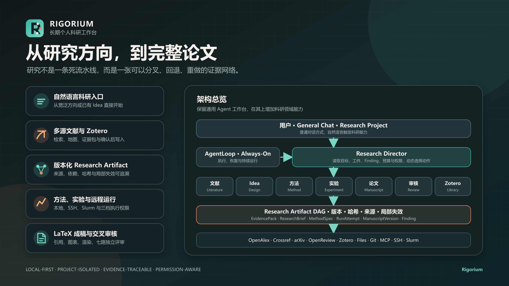

# Rigorium

[](LICENSE)
[](https://github.com/M-24rjgc/Rigorium/releases)
[](https://github.com/M-24rjgc/Rigorium#下载安装)

**长期个人科研工作台** | [English](./README.md)

<p align="center">
  
</p>

> 从研究方向，到完整论文。研究不是一条死流水线，而是一张可以分叉、回退、重做的证据网络。

---

## 这是什么

Rigorium 不是一个简单的聊天机器人，也不是一个抄文献的工具。它是一个**以证据可追溯为核心的长期科研执行环境**——从文献检索、Idea 孵化、方法设计、实验执行、远程运行，到 LaTeX 成稿与七路独立交叉审核，全部串在同一个工作台里。

与现有工具的关键区别：

- **不是 ChatBot**——Agent 可以直接操作你的文件系统、运行终端命令、读写代码、操控浏览器，不只是给文字建议
- **不是论文管理工具**——Rigorium 内部有一个完整的 Research Artifact DAG（有向无环图），每个中间产物（文献摘要、实验记录、草稿片段）都是内容寻址的不可变数据包，带着版本哈希和来源信息
- **不是固定流程**——Research Director 根据当前状态动态决定下一步做什么，而不是按照预设的阶段推进

---

## 核心设计

### 🧬 Research Artifact DAG

所有研究活动的中间产物都被保存为**不可变的 Artifact 信封**，每个 Artifact 由 `sha256` 内容寻址，携带类型、来源、父引用和版本号。

**支持的 Artifact 类型（18 种）：**
证据包（evidence_pack）、候选库（candidate_portfolio）、方法规格（method_spec）、实验规格（experiment_spec）、运行记录（run_attempt）、基线观察（baseline_observation）、指标观察（metric_observation）、图表（figure_table）、引文集（citation_set）、论文版本（manuscript_version）、渲染记录（render_run）、评审轮次（review_round）、发现（finding）、修订决策（revision_decision）……

**状态变迁：**
```
active → stale    （上游变化或收到修订决策时）
active → superseded （新版本追加时自动发生）
active → rejected
active → archived
```

当上游 Artifact 发生变化时，**失效传播引擎**自动 BFS 遍历依赖图，将所有下游受影响 Artifact 标记为 stale，告诉你哪些结论需要重新审视——不需要全盘推翻。

数据存储在每个项目的 `.rigorium/research/artifacts/manifest.json` 中，使用文件锁 + 原子写入，最大 64 MiB。

### 🎯 Research Director（科研调度器）

Director 不是一套固定的阶段机。它是一个**基于能力-依赖图谱的规划引擎**，每次运行时读取当前目标、已有 Artifact、预算和权限，然后输出一批可并行执行的 Action。

**工作模式：**
- `advance` —— 如果没有任何 stale Artifact，向前推进
- `repair` —— 如果有 stale Artifact 或未解决的 Finding，启动修复流程

**6 种决策结果：**
| 决策 | 含义 |
|---|---|
| `branch` | 有新候选方向，分叉探索 |
| `eliminate` | 方向不可行，淘汰 |
| `rescan` | 证据不足，重新扫描 |
| `revise` | 需要修订已有产出 |
| `recover` | 可恢复的失败，重试 |
| `stop` | 目标达成或已取消 |

**确认边界（Confirmation Boundaries）：** 以下操作需要你明确授权——
`zotero_write`（写入 Zotero 文献库）、`export`（导出）、`snapshot`（快照）、`final_title`（确认最终标题）、`budget_auto`（自动预算调整）。

### 🤖 Agent 执行引擎

Rigorium 的 Agent 不是单纯的 API 调用封装。它拥有一套完整的执行循环（`AgentLoop`），内建多项生产级能力：

**多阶段错误恢复：**
- **Token 限自动加倍**：输出被截断时，单次自动翻倍重试
- **续写恢复**：最多 50 轮续写提示，从截断处继续
- **JSON 自纠正**：最多 3 次自动修复无效 JSON 参数
- **空响应恢复**：当模型只输出了 thinking（无可见文本），自动提示重试
- **大文件修复**：检测到 `write_file`/`edit_file` 被截断时，自动注入结构化恢复提示
- **熔断器**：同一工具连续 3 次以相同方式失败，注入一次宽限提示后终止循环

**透明合成提示：**
恢复时注入的合成消息带有 `synthetic: true` + `transient: true` 标记，恢复完成后自动从上下文移除，不会污染对话记录。

**子 Agent 系统（4 种预设）：**
| 类型 | 可用工具 | 只读 | 说明 |
|---|---|---|---|
| `general-purpose` | 全部 | 否 | 通用委托任务 |
| `explore` | read、grep、glob、bash | 是 | 纯代码/文件探索 |
| `plan` | read、grep、glob | 是 | 纯规划，不执行 |
| `verify` | read、grep、glob、bash | 是 | 验证生成结果 |

子 Agent 在与父级隔离的会话中运行，上下文仅包含委托指令，无历史干扰。输出必须遵循 5 字段结构化报告（`Scope / Result / Key files / Files changed / Issues`）。

### 🧠 智能模型路由

不是简单地调用某个 API。Rigorium 内置了一个完整的路由引擎（`RouterRuntime`），支持：

- **场景化路由**：根据任务类型自动选择模型
- **Token Saver**：简单任务走廉价模型，复杂任务走强模型
- **缓存感知切换**：判断切换模型的成本是否值得（考虑上下文回填成本）
- **回退链**：一个 Provider 失败时，跨 Provider 自动回退
- **零用量重试**：检测到零 token 输出时自动重试
- **会话亲和性**：同一会话尽量保持同一模型以利用缓存
- **自定义路由**：通过扩展系统注册自定义路由策略
- **用量统计**：按项目/模型/层级追踪 token 和成本

**支持的模型 Provider：** Anthropic（Claude）、OpenAI、Google（Gemini）、OpenAI-Responses。

### 📦 三层上下文压缩

长时间对话的上下文管理是一个关键挑战。Rigorium 实现了三层递进式压缩：

1. **Micro（微压缩）**：基于时间裁剪旧的 tool_result 内容
2. **Snip（裁剪中间轮次）**：保留首尾 + 关键轮次，用 `<snip-boundary>` 标记
3. **Full（模型摘要）**：调用模型将早期对话摘要为结构化 Markdown

**阈值：** 上下文预算达到 80%（预警）或 95%（阻塞）时自动触发压缩。后路由阶段还会根据所选模型的窗口大小再评估一次。

**大结果卸载：** `ToolResultBudget` 自动将超过 200KB 的工具结果写到磁盘，在上下文中用引用占位符替代。

### 🔌 工具系统

Rigorium 内置了 30+ 工具，覆盖完整的 Agent 执行能力：

**内置工具（不完全列表）：**
`read_file` · `write_file` · `edit_file` · `bash` · `grep` · `glob` · `web_fetch` · `web_search` · `agent`（委托子 Agent）· `ask_user_question` · `structured_output` · `todo_write` · `plan_file` · `plan_mode` · `read_skill` · `get_current_time` · `send_attachment` · `title_confirm` · `mcp_tool` · `mcp_resources` · `task_tools` + 全套科研工具

**科研专用工具：**
`literature_search`（多源文献检索）· `literature_deep_search` · `literature_expand`（引文扩展）· `literature_maintenance` · `literature_closeout` · `research_artifacts`（Artifact 持久化）· `research_director`（规划决策）· `research_design` · `research_design_brief` · `research_method` · `research_review` · `direction_assess` · `direction_seed` · `direction_lifecycle` · `experiment_remote`（远程实验）· `experiment_control` · `experiment_analysis` · `manuscript_latex`（LaTeX 全流程）

所有工具调用都有审计记录。工具执行受三档权限控制（预览 / 审批 / 自动）。

### 🔐 权限与安全

- **三档执行权限：** `default`（危险操作需确认）、`plan`（只读规划）、`bypassPermissions`（完全信任）
- **确认边界：** 涉及 Zotero 写入、文件导出、预算变更等操作需要明确授权
- **生命周期钩子：** `PreModelRequest`、`Stop`、`StopFailure` 等事件可以插入安全检查
- **项目隔离：** 每个项目拥有独立的 Artifact 仓库、记忆、会话和配置

---

## 科研工作流

### 📚 多源文献检索

同时搜索 **arXiv**、**OpenAlex**、**Crossref**、**OpenReview** 四大文献源：

- **arXiv** —— 通过官方 API 搜索，遵守 3 秒最小间隔，防御性解析 ATOM XML
- **OpenAlex** —— 可配置端点，支持分页、重试、速率限制
- **Crossref** —— 支持指针分页，可配置 polite pool
- **OpenReview** —— 仅在提供官方 venue ID 时查询，不做无约束搜索

**去重：** 使用 **倒数排序融合（RRF, K=60）**。强标识符（DOI、arXiv ID）优先，弱匹配器在无强标识符时要求标准化标题 + 同年份 + 同第一作者。

**文献地图：** 实时维护的论文关系图（节点 + 边），支持身份解析（同一论文的多源 ID 合并）、状态流转（`candidate → relevant → core → irrelevant`）、差异计算。

**证据包：** 可引用的内容快照，携带精确定位（来源、页码、段落、字符范围）和内容哈希。上限 256 条，单条 2MB。

**新颖性重扫描：** 定期对候选方向重新检索，评估新颖性（`gap_signal / crowded / not_established`）和价值（`promising / mixed / weak`）。

### 🧪 实验与远程执行

支持三种执行后端（`local` / `ssh` / `slurm`）：

- **本地 Worker**：隔离工作空间、输入 JSON、stdout/stderr 采集、强制超时
- **SSH**：OpenSSH 传输，严格已知主机验证，远端 Agent 生命周期管理
- **Slurm**：构建 Slurm 提交参数，解析作业队列和计费记录

**执行授权模式：** `plan_only`（仅规划不执行）· `confirm_each`（每次确认）· `budget_auto`（预算内自动执行）

**预算追踪：** 跟踪保留和消耗的墙钟时间和美元成本。支持最大预算硬限制。使用 Kahan 求和保证精度。

**分析能力：**
- 学生 t 检验（95% 置信区间）
- Hedges' g 效应量（小样本校正）
- 帕累托前沿计算
- 多目标线性标量化
- 早停策略

### 📝 LaTeX 论文成稿

完整的 LaTeX 写作工作流：

- **引文集：** 从 Zotero 条目或 BibTeX 条目生成，自动检测引文冲突，链接回源记录
- **章节审计：** 验证所有章节引文是否在引文集中有对应条目，所有图表引用是否有匹配的图表 Artifact
- **相关工作规划：** 基于文献地图和证据包自动组织
- **模板探测：** 支持 ICLR 2026 模板（按 commit hash + SHA256 pin），验证模板目录完整性
- **多引擎渲染：** 支持 `latexmk` / `tectonic` / `pdflatex` / `xelatex` / `lualatex`，自动探测可用引擎
- **编译诊断：** 捕获错误、警告和信息（含文件和行号）
- **合规检查：** 编译成功、匿名性、页数限制、引文完整性、附录、模板一致性

### 🔍 七路独立评审

论文初稿完成后，Rigorium 运行**七个独立评审通道**：

1. **method** —— 方法论
2. **theory** —— 理论框架
3. **statistics** —— 统计方法
4. **evidence** —— 证据充分性
5. **novelty** —— 新颖性
6. **writing** —— 写作质量
7. **target_fit** —— 目标会议匹配度

**预检（Preflight）：** 纯确定性检查，不涉及 AI——
1. 编译渲染是否成功
2. 引文完整性（所有文本内引用是否可解析）
3. 页数限制（是否符合目标会议要求）
4. 匿名性（匿名投稿模式下是否有身份泄露）
5. 图表溯源（图表文件是否有对应的运行记录）

**修订决策：** 每条评审 Finding 必须有一个处理结果——
`revise`（修订，自动级联失效传播）| `dismiss`（驳回）| `defer`（延后）

---

## 架构总览

<p align="center">
  
</p>

### 通信层

Rigorium 支持 20+ 外部渠道接入，所有渠道复用同一套 Agent 运行环境：

飞书 · 微信 · QQ · 企业微信 · DingTalk · Discord · Slack · Telegram · Signal · WhatsApp · Matrix · Mattermost · Email · SMS · Home Assistant · Webhook · CLI · TUI · Web API

### 项目与会话

- 每个项目拥有独立的工作区、配置文件、Artifact 仓库、记忆空间
- 会话支持**分叉（fork）**：从任意历史消息分支出新对话
- 会话标题 AI 自动生成
- 空闲会话自动回收（默认 30 分钟）

### 桌面应用（Electron）

- 子进程管理：Gateway（端口 18789）+ UI Server，自动启停
- Zotero 安全凭证：OS 级加密存储（`safeStorage`）
- Zotero Broker：本地 HTTP 代理，临时令牌认证
- 启动时自动执行研究模块验证（arXiv、OpenAlex、术语管道）
- 自动更新：检查 GitHub Releases 通道，验证 SHA-256 完整性
- 日志：`desktop.log` 写入用户数据目录

---

## 下载安装

### Windows 桌面应用

从 [GitHub Releases](https://github.com/M-24rjgc/Rigorium/releases/latest) 下载最新安装包（当前 v0.2.1，约 142 MB）。桌面应用内置自动更新。

### Docker

```bash
docker compose up -d
```

Gateway 运行在 18789 端口，Web UI 运行在 3001 端口。详见 [Docker 部署指南](./README_DOCKER.zh.md)。

### 从源码运行

环境要求：Node.js `>=22.13.0 <23`，pnpm `10.32.1`

```powershell
corepack enable
corepack pnpm install --frozen-lockfile
corepack pnpm dev
```

生产构建后：

```powershell
rigorium
```

详见 [源码安装指南](./README_SOURCE_INSTALL.zh.md)。

---

## 当前状态

v0.2.1 · 早期开发阶段

**已落地：**
- 完整 Agent 执行循环（多阶段恢复、熔断器、透明合成提示）
- 4 种子 Agent 预设（general-purpose / explore / plan / verify）
- 智能模型路由（场景路由 / Token Saver / 回退链 / 缓存感知）
- 三层上下文压缩（Micro / Snip / Full）
- 30+ 内置工具 + 科研专用工具集
- 多源文献检索（arXiv / OpenAlex / Crossref / OpenReview）
- Research Artifact DAG（18 种类型，内容寻址，失效传播）
- Research Director（6 种决策，能力-依赖规划）
- 远程实验执行（local / SSH / Slurm，三档授权模式）
- LaTeX 完整工作流（引文 / 渲染 / 合规检查）
- 七路独立评审 + 预检 + 修订决策
- 20+ 通信渠道适配器
- 中英文 Web UI + 桌面 Electron 应用 + 自动更新
- Cron 定时任务 + Always-On 常驻执行
- 本地文件式记忆（MEMORY.md / 用户画像 / 项目记忆）
- 仪表盘（成本追踪 / 用量分析）

**持续构建中：**
- 文献证据包与自动综述
- 实验分析流水线（统计检验 / 优化 / 失效分析）
- 研究方向生命周期管理
- 研究方法元数据形式化

---

## 仓库与许可证

Rigorium 通过 [M-24rjgc/Rigorium](https://github.com/M-24rjgc/Rigorium) 独立构建、发布和更新。本项目基于 [OpenBMB/PilotDeck](https://github.com/OpenBMB/PilotDeck) 修改而来，以 [GNU Affero General Public License v3.0](LICENSE) 发布。完整的归属声明与第三方许可见 [NOTICE.md](NOTICE.md)。

---

<p align="center">
  <sub>LOCAL-FIRST · PROJECT-ISOLATED · EVIDENCE-TRACEABLE · PERMISSION-AWARE</sub>
</p>
